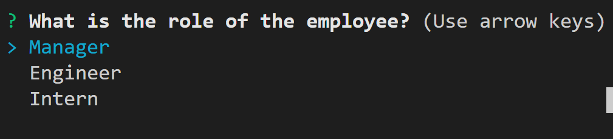
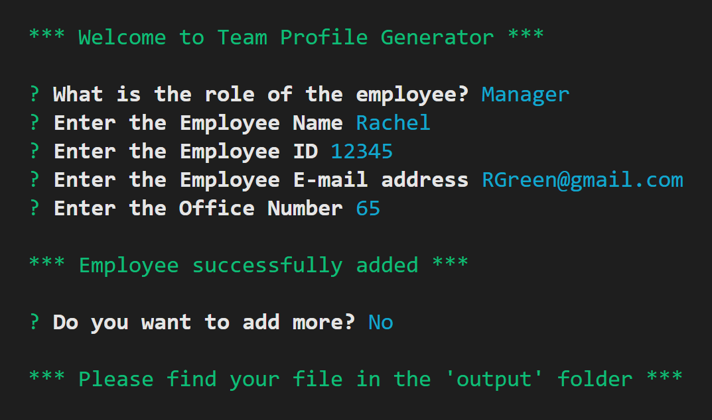
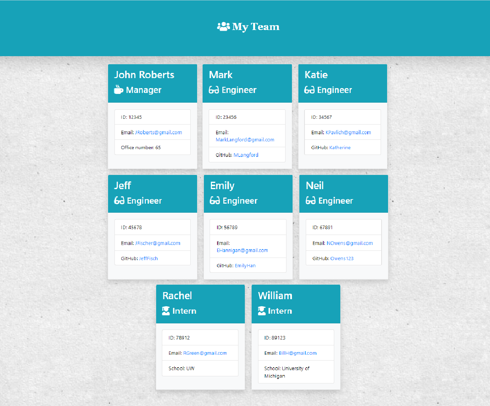

# Team-Profile-Generator
Generates a webpage to display a team's basic information

## Table of Contents

- Aim
- Usage and Instructions
- Technologies Used
- Environment

# Aim
For a manager of a decent sized team, it is time consuming to have to look up their employee's basic details at different places everytime its required. This CLI application is aimed to take in all the basic info of every team member and generate a html that neatly displays their info in one place.

# Usage and Instructions
When the application begins, the user is asked to enter the role of the employee first. Depending on the role, the further questions are asked. Once the user is done entering all of the required information, he is notified on the console, where to find the desired file. 

###### Command to run

`node app.js`

#### Demo

Find the video Demo here:
 
[Demo](https://drive.google.com/file/d/1xYcHNiHgQ4wYVqmB0CtRNGV1NFRvvIya/view)

# Technologies Used

- Bootstrap 
- inquirer, fs npm
- jest (for testing)

# Environment

Install `inquirer` package to utilize this application.
Run the `app.js` file.
The desired file is available in `./output` directory. (It will be created if doesnt already exist)

# Final Output 

